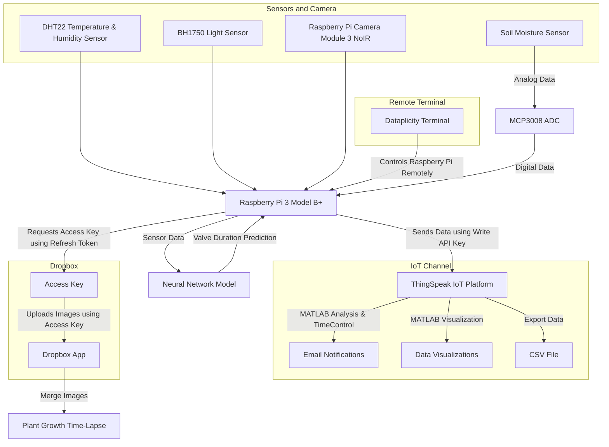

# Smart Watering System with IoT and Neural Network 🌱

### **[Winner of MathWorks' Sustainability and Renewable Energy Challenge 🏆](https://uk.mathworks.com/academia/students/competitions/student-challenge/sustainability-and-renewable-energy-challenge/2024-winners.html)**

## Table of Contents
- [Project Overview](#project-overview)
  - [YouTube Link](#youtube-link)
- [System Workflow](#system-workflow)
- [Hardware](#hardware)
- [Complete System Wiring](#complete-system-wiring)
- [ThingSpeak](#thingspeak)
  - [Channel Configuration](#channel-configuration)
  - [MATLAB Visualizations](#matlab-visualizations)
  - [Widgets for Real-Time Monitoring](#widgets-for-real-time-monitoring)
  - [Channel View](#channel-view)
  - [Automated Alerts and Actions](#automated-alerts-and-actions)
  - [Imported Data](#imported_data)
  - [Why ThingSpeak Matters](#why-thingspeak-matters)
  - [View the Channel Yourself!](#view-the-channel-yourself)
- [Predictive Model Analysis](#predictive-model-analysis)
  - [Data Preparation and Preprocessing](#data_preparation_and_preprocessing)
  - [Model Training](#model-training)
  - [Model Evaluation Metrics](#model-evaluation-metrics)
- [Installation and Usage](#installation-and-usage)
  - [Prerequisites](#prerequisites)
  - [Steps](#steps)
  - [Scripts for Machine Learning](#scripts-for-machine-learning)
- [Capturing Soil Moisture using Simulink](#capturing-soil-moisture-using-simulink)
- [Plant Growth Time-Lapse](#plant-growth-time-lapse)
- [References](#references)
- [More Information](#more-information)
- [Individual Sensor Setup](#individual-sensor-setup)

## **Project Overview**
The Smart Watering System with Internet of Things (IoT) and Neural Network is a sustainable solution aimed at optimizing water usage for plant care. By integrating hardware sensors, IoT connectivity, and AI-based predictive model, the system continuously monitors critical plant conditions, including soil moisture, temperature, humidity, and light intensity.

Utilizing these real-time inputs, a trained neural network predicts the precise amount of water required to maintain optimal plant health, ensuring water is neither wasted nor insufficient. Data from the sensors is seamlessly transmitted to ThingSpeak, an IoT cloud platform, for storage, visualization, and actionable analytics. The system also incorporates MATLAB for advanced data analysis, creating meaningful insights through plots and alert-triggering scripts.

This project is designed as part of the [Mathworks Sustainability and Renewable Energy Challenge](https://uk.mathworks.com/academia/students/competitions/student-challenge/sustainability-and-renewable-energy-challenge.html).

### **YouTube Link**

[](https://www.youtube.com/watch?v=7oP_TmdXER8)

## **System Workflow**
The diagram below shows the workflow of the Smart Watering System. It demonstrates how data flows from sensors to data processing, decision-making, and ultimately, visualization and storage.



## **Hardware**  
- **Central hub**:
  - [Raspberry Pi 3 Model B+](https://www.raspberrypi.com/products/raspberry-pi-3-model-b-plus/)
- **Sensors**:  
  - [Capacitive Soil Moisture Sensor (v1.2)](https://www.amazon.co.uk/dp/B0814HXWVV/ref=pe_27063361_487055811_TE_dp_2?th=1) 
  - [DHT22 Temperature and Humidity Sensor](https://thepihut.com/products/dht22-temperature-humidity-sensor-extras)
  - [BH1750 Light Sensor](https://thepihut.com/products/adafruit-bh1750-light-sensor-stemma-qt-qwiic)
- **Actuators**:
  - [Water pump](https://www.amazon.co.uk/dp/B0814HXWVV/ref=pe_27063361_487055811_TE_dp_2?th=1)
  - [2-channel 5V relay](https://thepihut.com/products/2-channel-relay-breakout-5v)
- **Camera**
  - [Raspberry Pi Camera Module 3 NoIR](https://thepihut.com/products/raspberry-pi-camera-module-3-noir)
- **Additional Equipment**:
  - [Bread Board](https://www.amazon.co.uk/dp/B0B5TCKTQH/ref=pe_27063361_487055811_TE_dp_1)
  - [Jumper Wires](https://www.amazon.co.uk/dp/B0B5TCKTQH/ref=pe_27063361_487055811_TE_dp_1)
  - [STEMMA QT / Qwiic JST SH 4-pin to Premium Male Headers Cable (150mm Long)](https://thepihut.com/products/stemma-qt-qwiic-jst-sh-4-pin-to-premium-male-headers-cable)
  - Ethernet for stable connectivity.  
  - Soil and Cress seeds for real-world testing
 
## **Complete System Wiring**
The complete system integrates all the sensors, water pump, and camera, ensuring seamless data collection and automation. The consolidated wiring diagram shows the connections for all components working together:


[Individual Sensor Setup](#individual-sensor-setup) includes the individual setup for each component.
 
## **ThingSpeak**

ThingSpeak serves as the IoT cloud platform for real-time monitoring, data visualization, and analytics in the Smart Watering System. Below is an overview of how the project leverages ThingSpeak for effective data management and insights.

### **Channel Configuration**
The ThingSpeak channel is set up with the following fields:  

- **Field 1:** Soil Moisture (%)  
- **Field 2:** Temperature (ºC)  
- **Field 3:** Humidity (%)  
- **Field 4:** Light Intensity (lux)  
- **Field 5:** Valve Duration (s)  

Fields 1 to 4 log real-time sensor data, while Field 5 records predictions from the Neural Network model, which estimates the valve duration based on sensor inputs.
### **MATLAB Visualizations**
ThingSpeak integrates MATLAB for advanced data visualization and analysis. Two MATLAB scripts are used for this project:  

1. `scripts/ThingSpeak/soil_moisture_vs_valve_duration.m`: Visualizes the relationship between soil moisture and valve duration.  
2. `scripts/ThingSpeak/humidity_vs_temperature.m`: Displays the kernel density estimation for temperature and humidity, revealing key environmental patterns.    

### **Widgets for Real-Time Monitoring**
A **gauge widget** is configured to track soil moisture levels at a glance, with states represented as:  
- **Red:** Danger zone (below 30% or above 70%)
- **Green:** Healthy range (50% to 60%)
- **Amber:** Warning zone (anything else)

### **Channel View**
The following figures illustrate the ThingSpeak channel for this project:

 

 

#### **Key Observations:**  
- The Soil Moisture vs. Valve Duration scatter plot highlights an inverse relationship: as soil moisture increases, valve duration decreases.  
- The Temperature vs. Humidity KDE shows the plant environment is typically in the 20–21°C range with ~60% humidity.

### **Automated Alerts and Actions**
ThingSpeak's MATLAB analysis scripts and TimeControl feature automate system responses:  
- `scripts/ThingSpeak/alert.m` runs every 6 hours to check soil moisture levels.  
- If the soil moisture enters the danger zone (below 30% or above 70%), an email notification is triggered.

### **Imported Data**

The data imported from ThingSpeak can be viewed in `results/thingspeak/ThingSpeak_data.csv`.

### **Why ThingSpeak Matters**
- ThingSpeak enhances the Smart Watering System by turning raw data into actionable insights and enabling proactive system management:
- Real-Time Monitoring: Visualizations of real-world data allow for consistent and reliable plant monitoring.
- Data Interpretation: MATLAB visualizations provide deeper insights, helping to analyze and understand the collected data effectively.
- Automated Responses: The integration of MATLAB Analysis and TimeControl enables automated actions, such as sending alerts for waterlogged or excessively dry soil conditions.
- Critical Metrics at a Glance: Widgets simplify monitoring by highlighting essential metrics like soil moisture in an intuitive and accessible format.

### **View the Channel Yourself!**
You can visit this channel by going to [Public Channels on ThingSpeak](https://thingspeak.mathworks.com/channels/public). Search for the tag: `Smart Watering System` or user ID: `mwa0000034847465`, and the channel will be listed for access.

## **Predictive Model Analysis**

### **Data Preparation and Preprocessing**

The Smart Watering System leverages machine learning models to predict the optimal duration for activating the water pump, based on environmental sensor data such as soil moisture, temperature, humidity, and light levels. To achieve accurate predictions, the project utilizes a synthetically generated dataset that closely simulates real-world conditions.

#### **Synthetic Data Generation**

`scripts/generate_data.m`: The synthetic dataset is created using a formula that calculates valve duration based on the following parameters:

1. **Soil Moisture:** Strongly influences the valve duration. If soil moisture exceeds 60%, the valve remains closed to prevent overwatering.
2. **Temperature, Humidity, and Light Level:** Adjustments are applied to fine-tune the valve duration based on environmental conditions.

The formula is:

```matlab
calculateValveDuration = @(soilMoisture, temperature, humidity, lightLevel) ...
    (soilMoisture <= 60) * ...
    max(0.0, min(3.0, ...
    5 * (1 - (soilMoisture / 60)) + ...
    max(0, (temperature - 20) * 0.05) - ...
    max(0, (humidity - 50) * 0.02) + ...
    (lightLevel / 2000)));
```

- **Output Range:** The valve duration is capped between 0 and 3 seconds.
- **Purpose:** This range ensures efficient water usage and avoids overwatering or under-watering accounting for the pump's operational speed.

#### **Data Preprocessing**

`scripts/train_models.m` preprocesses the data and trains the models.

1. Loading the Dataset: The synthetic CSV file is read into a MATLAB table.

```matlab
data = readtable('../data/system_data.csv');
```

2. Feature and Target Extraction

- Features: Soil Moisture (%), Temperature (°C), Humidity (%), Light Level (lx)
- Target: Valve Duration (s)

```matlab
X = data{:, {'SoilMoisture___', 'Temperature__C_', 'Humidity___', 'LightLevel_lx_'}};
Y = data{:, 'ValveDuration_s_'};
```

3. Feature Normalization: Features are scaled to zero mean and unit variance to improve model performance.

```matlab
X = normalize(X);
```

4. Data Splitting:

- Training set: 80% of the data
- Testing set: 20% of the data

```matlab
cv = cvpartition(size(data, 1), 'HoldOut', 0.2);
X_train = X(training(cv), :);
Y_train = Y(training(cv), :);
X_test = X(test(cv), :);
Y_test = Y(test(cv), :);
```

### **Model Training**

Three machine learning models were trained and evaluated: **Linear Regression**, **Random Forest**, and a **Neural Network**.

#### **1. Linear Regression**

##### **Training Code:**

```matlab
linRegModel = fitlm(X_train, Y_train);
```

##### **Model Saving**

```matlab
save('../models/linear_regression_model.mat', 'linRegModel', 'X_test', 'Y_test');
```
#### **2. Random Forest**

A Random Forest regression model is trained using 50 decision trees. The random seed is reset for reproducibility.

##### **Training Code:**

```matlab
rng(0);
numTrees = 50;
rfModel = TreeBagger(numTrees, X_train, Y_train, 'Method', 'regression');
```

##### **Model Saving**

```matlab
save('../models/random_forest_model.mat', 'rfModel', 'X_test', 'Y_test');
```

#### **3. Neural Network**

A feedforward neural network is defined with the following architecture:
- Input layer for the features
- Two fully connected layers with ReLU activation
- Output layer for regression
- Regression layer for training

The training options are configured as follows:

- Optimizer: adam
- Maximum Epochs: 50
- MiniBatch Size: 32
- Training progress plots enabled

##### **Training Code:**

```matlab
layers = [
    featureInputLayer(size(X_train, 2))
    fullyConnectedLayer(64)
    reluLayer
    fullyConnectedLayer(32)
    reluLayer
    fullyConnectedLayer(1)
    regressionLayer
];

options = trainingOptions('adam', ...
    'MaxEpochs', 50, ...
    'MiniBatchSize', 32, ...
    'Plots', 'training-progress', ...
    'Verbose', false);

net = trainNetwork(X_train, Y_train, layers, options);
```

##### **Training Progress:**


##### **Model Saving**

```matlab
save('../models/neural_network_model.mat', 'net', 'X_test', 'Y_test');
```

### **Model Evaluation Metrics**

The performance of these models was assessed using the following metrics:
- Root Mean Square Error (RMSE): Measures the average magnitude of prediction errors.
- Mean Absolute Error (MAE): Represents the average absolute difference between predicted and actual values.
- Residuals: Highlights the distribution of prediction errors.

#### **RMSE & MAE Analysis**

- The Neural Network demonstrated the best performance, achieving the lowest MAE of 0.05 and RMSE of 0.07. This indicates that the Neural Network can make highly accurate predictions with minimal average error and few significant outliers.
- The Random Forest model, while not as precise as the Neural Network, performed moderately well. With an MAE of 0.10 and RMSE of 0.15, it captured some non-linear relationships in the data but introduced more error compared to the Neural Network.
- Linear Regression exhibited the highest error rates, with an MAE of 0.26 and RMSE of 0.32. This suggests that it struggled to model the complex relationships inherent in the data, likely due to its linear assumptions.

A comparative visualization of the models' RMSE and MAE is shown below, reinforcing the Neural Network's superior performance:


#### **Residual Analysis**
Residual analysis provides deeper insights into model performance by examining the differences between actual and predicted values. The next figure shows predicted vs. actual plots for each model, along with their respective residual plots.


- Neural Network: The predicted vs. actual plot for the Neural Network aligns closely with the diagonal line, reflecting high accuracy. The residual plot shows a symmetrical distribution around zero, with no discernible patterns, indicating a well-calibrated model.
- Random Forest: While the Random Forest predicted vs. actual plot shows some deviations from the diagonal, its residuals are also symmetrically distributed with no apparent patterns, suggesting reasonable accuracy despite minor inconsistencies.
- Linear Regression: Linear Regression’s predicted vs. actual plot reveals substantial deviations, and its residual plot shows a clear pattern with a positive slope. This suggests systematic errors and a lack of flexibility in capturing complex data relationships.

To facilitate a direct comparison, the following figure combines the predicted vs. actual values of all three models in a single plot and includes a distribution of residuals:


The combined predicted vs. actual plot underscores the Neural Network’s accuracy, with its predictions clustered closest to the diagonal. Random Forest follows, while Linear Regression exhibits the greatest deviation.

The residual distribution plot further highlights the differences:

- The Neural Network has the highest peak and the narrowest domain, indicating tightly clustered residuals around zero.
- Random Forest has a lower peak and a broader spread, showing moderate variability in residuals.
- Linear Regression exhibits the lowest peak and the widest domain, reflecting larger and more inconsistent residuals.

Based on the evaluation of RMSE, MAE, and residuals, the Neural Network demonstrated the highest accuracy and consistency among the three models. It successfully captured the complex relationships in the data, making it the most suitable choice for the Smart Watering System’s predictive model. This selection ensures optimal pump activation, minimizing water wastage while maintaining plant health.

## **Installation and Usage**

### **Prerequisites**
- Hardware Components mentioned above for real-world testing
- Python 3.11
- MATLAB with Deep Learning and Statistics and Machine Learning Toolbox
- ThingSpeak, Dropbox, and Dataplicity accounts

### **Steps**
1. Clone the repository:

```bash
git clone https://github.com/Gonzaleski/Smart-Watering-System.git
```

2. Go inside the reopsitory:

```bash
cd Smart-Watering-System
```

3. Create a Dropbox App:

- Login to https://www.dropbox.com/developers/apps
- Tap on `Create App`
- Select `Scoped access`
- Select `App folder`
- Give your app a name and tap on `Create App`
- In `Settings`, record your App Key
- In `Permissions`, enable `file.metadata.write`, `file.metadata.read`, `file.content.write`, and `file.content.read`
- Click on `Submit`

4. Get a Dropbox refresh token:

```bash
cd scripts
```

Run the program in the MATLAB Command Window:

```matlab
get_refresh_token.m
```

Record the refresh token value.

5. Create a ThingSpeak Channel:

- Login to https://thingspeak.mathworks.com/login?skipSSOCheck=true
- Tap on `New Channel`
- Give your channel a name and a description
- `Field 1: Soil Mositure (%)`
- `Field 2: Temperature (ºC)`
- `Field 3: Humidity (%)`
- `Field 4: Light (lux)`
- `Field 5: Valve Duration`
- `Save Channel`
- In `API Keys`, redord your `Write API Key`

6. Create the environmental variables:

```bash
nano .env
```

Paste the following code in it:

```bash
THINGSPEAK_WRITE_API_KEY="Your_ThingSpeak_Write_API_Key"
DROPBOX_APP_KEY="Your_Dropbox_App_Key"
DROPBOX_REFRESH_TOKEN="Refresh_Token_Recorded_Above"
```

Save the file:
- `Cntrl+X`
- `y`
- `Enter`

7. Run the program:

Make sure the `SPI` and `I2C` are enabled on Raspberry Pi.

Run the program in the MATLAB Command Window:

```matlab
main
```

### **Scripts for Machine Learning**

- Open MATLAB
- To generate data: `scripts/generate_data.m`
- To train the models: `scripts/train_models.m`
- To visualize the results: `scripts/visualize_models.m`
- To calculate mean and standard deviation for dataset features: `scripts/calculate_mean_and_standard_deviation_values.m`
- To test the neural network model with sample data: `scripts/test.m`
  - Optionally change the sample data
  - Fill the mean_values and the std_values with the output of the `scripts/calculate_mean_and_standard_deviation_values.m` script
 
## **Capturing Soil Moisture using Simulink**
https://github.com/user-attachments/assets/ef57deae-c313-46e5-ae23-650645be34ba

## **Plant Growth Time-Lapse**
https://github.com/user-attachments/assets/f08c9249-cb3b-4409-939e-81bdf88dc75e

## **References**
- [Quatltrics, Interpreting Residual Plots to Improve Your Regression](https://www.qualtrics.com/support/stats-iq/analyses/regression-guides/interpreting-residual-plots-improve-regression/)
- [Raspberry Pi Foundation, Getting started with the Camera Module](https://projects.raspberrypi.org/en/projects/getting-started-with-picamera/2)
- [Components101, Raspberry Pi 3 (2018)](https://components101.com/microcontrollers/raspberry-pi-3-pinout-features-datasheet)
- [MathWorks, Analyze Channel Data to Send Email Notification](https://uk.mathworks.com/help/thingspeak/analyze-channel-data-to-send-email.html)

## **More Information**

### **Individual Sensor Setup**
The following figure illustrates the Rasberry Pi 3 Model B+ Pinout:

 

1. Soil Moisture Sensor and MCP3008 ADC

The following figure illustrates the MCP3008 Pinout:

 

- MCP3008:
  - `VCC`: Connect to 3.3V on the Raspberry Pi
  - `VREF`: Connect to 3.3V on the Raspberry Pi
  - `AGND`: Connect to Ground (GND)
  - `CLK`: Connect to GPIO11/CLK
  - `MISO`: Connect to GPIO9/MISO
  - `MOSI`: Connect to GPIO10/MOSI
  - `CS`: Connect to GPIO08/CE0
  - `DGND`: Connect to Ground (GND)

- Soil Moisture Sensor:
  - `VCC`: Connect to 3.3V on the Raspberry Pi
  - `GND`: Connect to Ground (GND)
  - `AOUT`: Connect to an analog input through the MCP3008 ADC (Channel 0)

 

2. DHT22 Temperature and Humidity Sensor

The following figure illustrates the DHT22 Pinout:

 

- `VCC`: Connect to 3.3V on the Raspberry Pi
- `GND`: Connect to Ground (GND)
- `DATA`: Connect to a GPIO pin on the Raspberry Pi (e.g., GPIO17)
- A 10kΩ resistor between the VCC and DATA pins


3. BH1750 Light Sensor
- `VCC`: Connect to 3.3V on the Raspberry Pi
- `GND`: Connect to Ground (GND)
- `SCL`: Connect to the I2C clock pin (GPIO3/SCL)
- `SDA`: Connect to the I2C data pin (GPIO2/SDA)


4. Water Pump and Relay
- `VCC`: Connect to 5V on the Raspberry Pi
- `GND`: Connect to Ground (GND)
- `IN`: Connect to a GPIO pin on the Raspberry Pi (GPIO27)
- `COM`: Connect to 5V on the Raspberry Pi
- `NO`: Connect to positive wire of the water pump
- Connect the negative wire of the water pump to the `GND`


5. Camera
- Locate the Camera Module port
- Gently pull up on the edges of the port’s plastic clip
- Insert the Camera Module ribbon cable; make sure the connectors at the bottom of the ribbon cable are facing the contacts in the port.
- Push the plastic clip back into place


